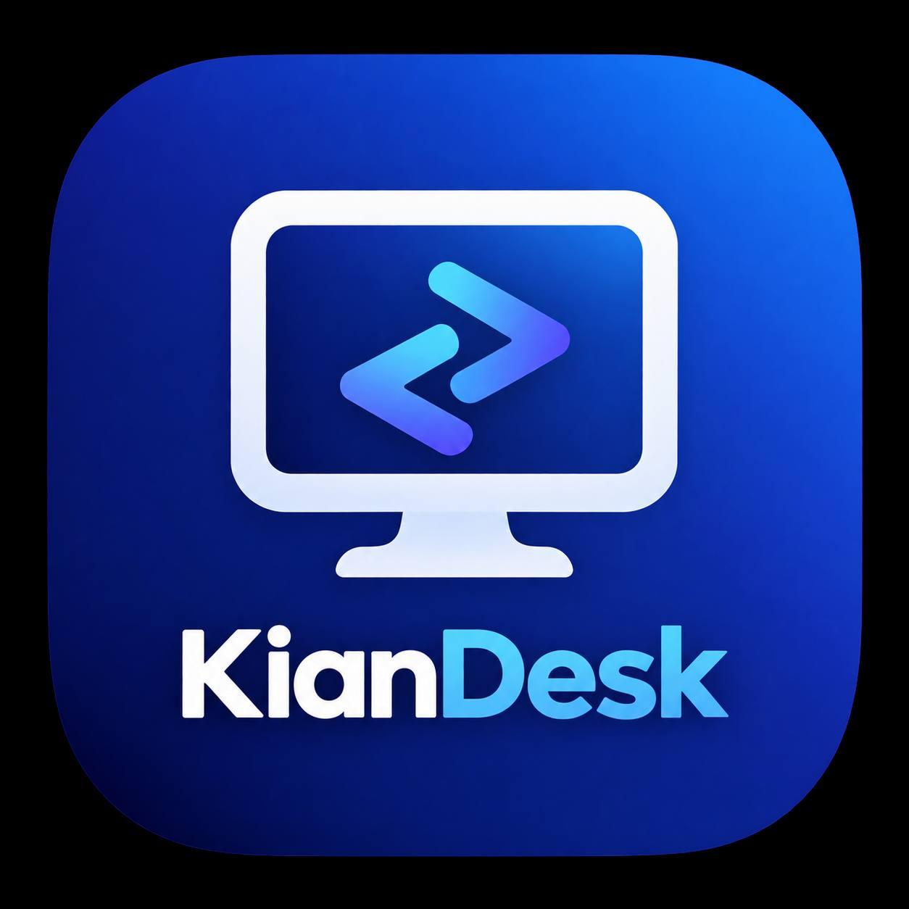

<p align="center">
  <br>
  <b>KianDesk</b> — دسکتاپ ریموت شما، تحت کنترل کامل شما
</p>

<p align="center">
  
  
  
  <a href="../LICENCE"></a>
  <a href="https://github.com/freeb5d/KianDesk/releases"></a>
</p>

<p align="center" dir="rtl">
  <a href="#درباره">درباره</a> •
  <a href="#امکانات">امکانات</a> •
  <a href="#ساخت">ساخت</a> •
  <a href="#داکر">داکر</a> •
  <a href="#ساختار-پروژه">ساختار پروژه</a><br>
  [<a href="../README.md">English</a>] | [<a href="README-AR.md">العربية</a>] | [<a href="README-ZH.md">中文</a>]
</p>

---

> [!Caution]
> **سلب مسئولیت سوءاستفاده:** توسعه‌دهندگان KianDesk هیچ‌گونه استفاده غیراخلاقی یا غیرقانونی از این نرم‌افزار را تأیید یا پشتیبانی نمی‌کنند. سوءاستفاده‌هایی مانند دسترسی غیرمجاز، کنترل یا نقض حریم خصوصی، کاملاً مغایر با دستورالعمل‌های ماست. نویسندگان مسئولیتی در قبال سوءاستفاده از این برنامه ندارند.

## درباره

KianDesk یک کلاینت دسکتاپ ریموت خوداستقرار برای **ویندوز، مک و لینوکس** است. این برنامه هسته‌ای پرقدرت بر پایه Rust را با رابط کاربری بومی Flutter ترکیب می‌کند تا کنترل ریموت سریع و کم‌تأخیر را بدون وابستگی به زیرساخت دیگران فراهم کند.

هیچ ثبت‌نامی، هیچ رله شخص ثالثی و هیچ ردیابی وجود ندارد — KianDesk فقط به سروری از نوع [KianDesk-Server](https://github.com/freeb5d/KianDesk-Server) متصل می‌شود که خودتان اجرا و کنترل می‌کنید. جلسات شما، داده‌های شما، سرور شما.

## امکانات

- کنترل ریموت سریع و کم‌تأخیر با قدرت Rust
- اتصال منحصراً به سرور اختصاصی شما — بدون رله شخص ثالث
- انتقال فایل، همگام‌سازی کلیپ‌بورد و انتقال صدا
- نسخه‌های بومی برای ویندوز، مک و لینوکس

## ساخت

### وابستگی‌ها

رابط کاربری دسکتاپ از Flutter استفاده می‌کند که با هسته Rust پشتیبانی می‌شود.

### شروع سریع

۱. یک محیط توسعه Rust و ابزار ساخت ++C آماده کنید.

۲. [vcpkg](https://github.com/microsoft/vcpkg) را نصب کرده و متغیر محیطی `VCPKG_ROOT` را تنظیم کنید.

```sh
# ویندوز
vcpkg install libvpx:x64-windows-static libyuv:x64-windows-static opus:x64-windows-static aom:x64-windows-static

# لینوکس / مک
vcpkg install libvpx libyuv opus aom
```

۳. پروژه را اجرا کنید:

```sh
cargo run
```

### ساخت در لینوکس

<details>
<summary>اوبونتو ۱۸ (دبیان ۱۰)</summary>

```sh
sudo apt install -y zip g++ gcc git curl wget nasm yasm libgtk-3-dev clang libxcb-randr0-dev libxdo-dev \
        libxfixes-dev libxcb-shape0-dev libxcb-xfixes0-dev libasound2-dev libpulse-dev cmake make \
        libclang-dev ninja-build libgstreamer1.0-dev libgstreamer-plugins-base1.0-dev
```
</details>

<details>
<summary>openSUSE Tumbleweed</summary>

```sh
sudo zypper install gcc-c++ git curl wget nasm yasm gcc gtk3-devel clang libxcb-devel libXfixes-devel cmake alsa-lib-devel gstreamer-devel gstreamer-plugins-base-devel xdotool-devel
```
</details>

<details>
<summary>فدورا ۲۸ (سنت‌اواس ۸)</summary>

```sh
sudo yum -y install gcc-c++ git curl wget nasm yasm gcc gtk3-devel clang libxcb-devel libxdo-devel libXfixes-devel pulseaudio-libs-devel cmake alsa-lib-devel gstreamer1-devel gstreamer1-plugins-base-devel
```
</details>

<details>
<summary>آرچ (مانجارو)</summary>

```sh
sudo pacman -Syu --needed unzip git cmake gcc curl wget yasm nasm zip make pkg-config clang gtk3 xdotool libxcb libxfixes alsa-lib pipewire
```
</details>

<details>
<summary>مراحل کامل ساخت (نصب vcpkg، رفع مشکل libvpx در فدورا، ساخت)</summary>

```sh
# نصب vcpkg
git clone https://github.com/microsoft/vcpkg
cd vcpkg
git checkout 2023.04.15
cd ..
vcpkg/bootstrap-vcpkg.sh
export VCPKG_ROOT=$HOME/vcpkg
vcpkg/vcpkg install libvpx libyuv opus aom
```

```sh
# رفع مشکل libvpx (فقط فدورا)
cd vcpkg/buildtrees/libvpx/src
cd *
./configure
sed -i 's/CFLAGS+=-I/CFLAGS+=-fPIC -I/g' Makefile
sed -i 's/CXXFLAGS+=-I/CXXFLAGS+=-fPIC -I/g' Makefile
make
cp libvpx.a $HOME/vcpkg/installed/x64-linux/lib/
cd
```

```sh
# ساخت
curl --proto '=https' --tlsv1.2 -sSf https://sh.rustup.rs | sh
source $HOME/.cargo/env
git clone --recurse-submodules https://github.com/freeb5d/KianDesk
cd KianDesk
VCPKG_ROOT=$HOME/vcpkg cargo run
```
</details>

## داکر

مخزن را کلون کرده و ایمیج داکر را بسازید:

```sh
git clone https://github.com/freeb5d/KianDesk
cd KianDesk
git submodule update --init --recursive
docker build -t "kiandesk-builder" .
```

برنامه را با این دستور بسازید:

```sh
docker run --rm -it -v $PWD:/home/user/rustdesk -v kiandesk-git-cache:/home/user/.cargo/git -v kiandesk-registry-cache:/home/user/.cargo/registry -e PUID="$(id -u)" -e PGID="$(id -g)" kiandesk-builder
```

ساخت اول وابستگی‌ها را کش می‌کند و بیشتر طول می‌کشد؛ ساخت‌های بعدی سریع‌تر خواهند بود. برای ساخت بهینه‌شده، `--release` را به انتهای دستور بالا اضافه کنید. فایل اجرایی نهایی در پوشه `target` قرار می‌گیرد:

```sh
target/debug/rustdesk      # نسخه دیباگ
target/release/rustdesk    # نسخه انتشار
```

این دستورات را از ریشه مخزن KianDesk اجرا کنید تا برنامه منابع مورد نیاز خود را پیدا کند.

## ساختار پروژه

| مسیر | توضیح |
| --- | --- |
| [`libs/hbb_common`](../libs/hbb_common) | کدک ویدیو، تنظیمات و wrapper شبکه tcp/udp مشترک با سرور |
| [`libs/base`](../libs/base) | protobuf، کد انتقال فایل و کیبورد مخصوص این برنامه |
| [`libs/scrap`](../libs/scrap) | ضبط صفحه |
| [`libs/enigo`](../libs/enigo) | کنترل کیبورد/ماوس مخصوص پلتفرم |
| [`libs/clipboard`](../libs/clipboard) | کپی/پیست فایل برای ویندوز، لینوکس، مک |
| [`src/server`](../src/server) | سرویس‌های صدا/کلیپ‌بورد/ورودی/ویدیو و اتصالات شبکه |
| [`src/client.rs`](../src/client.rs) | نقطه شروع اتصال peer |
| [`src/rendezvous_mediator.rs`](../src/rendezvous_mediator.rs) | ارتباط با [KianDesk-Server](https://github.com/freeb5d/KianDesk-Server) |
| [`src/platform`](../src/platform) | کدهای مخصوص پلتفرم |
| [`flutter`](../flutter) | رابط کاربری دسکتاپ Flutter |

## مجوز

به [LICENCE](../LICENCE) مراجعه کنید.
